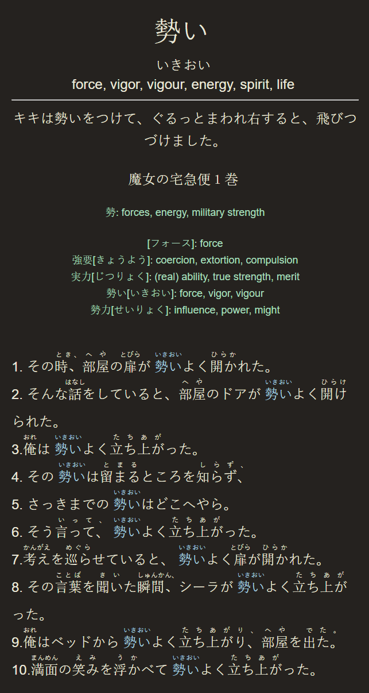

# Japanese Anki Flash Card Generator

A helpful tool for making [Anki](https://apps.ankiweb.net/) flash cards with Japanese terms and sentences. Generally used for study techniques based on [spaced repitition](https://en.wikipedia.org/wiki/Spaced_repetition).

## Features
* Web scrapes with Python [Requests](https://docs.python-requests.org) and searches for Japanese text
* Processes scraped html web pages and extracts example text with [Beautiful Soup](https://www.crummy.com/software/BeautifulSoup/)
* Retrieves definitions, synonyms, and kanji for target words using [Jamdict](https://jamdict.readthedocs.io/en/latest/)
* [Pykakasi](https://pykakasi.readthedocs.io/en/latest/api.html) adds furigana to all extracted text
* [Tokenization](https://en.wikipedia.org/wiki/Lexical_analysis#Tokenization) via [Fugashi](https://www.dampfkraft.com/nlp/how-to-tokenize-japanese.html) refines sample text by filtering sentences based on their relevance
* Neatly formats fields and writes them to a .tsv file that can be easily imported into Anki

## How to Use
Linux :
1. Save 'mined' words and sentences to a .tsv file, as formatted like below:
> \<term\>\t\<sentence\>\t\<source\>\n
2. Save the .tsv file inside the folder 'words'
3. Navigate to the project folder
4. (Optional) Set up a virtual environment
5. Install the depencies.
> pip install -r requirement.txt
6. Run the command:
> python main.py <file.tsv>
7. In Anki, go to File > Import and select 'output.tsv'

  

## Dependencies
* Developed with Python 3.8.10. Using a virtual environment is highly recommended.
* [Python Requests](https://docs.python-requests.org)
* [Beautiful Soup](https://beautiful-soup-4.readthedocs.io/en/latest/#installing-beautiful-soup)
* [Jamdict](https://github.com/neocl/jamdict)
* [Pykakasi](https://github.com/miurahr/pykakasi)
* [Fugashi](https://github.com/polm/fugashi)

## To Do
* Add case for terms with parenthesis (ex, おとなしい　(大人しい))
* Prevent searching homophones (e.g., "変わる" and "替わる")
* Refine highlighting for target words
* Refactor main.py
* Add more text sources
* Create gitignore for env
